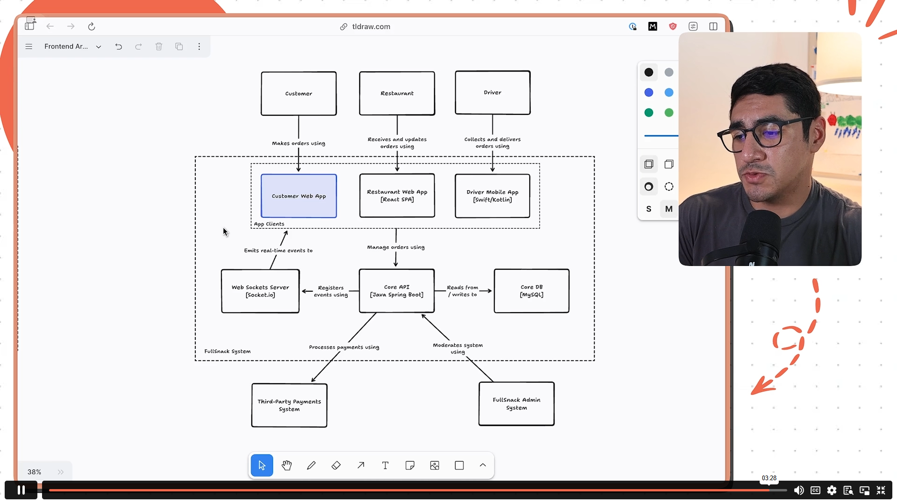

# 23/02/2026

Hari ini saya menonton Exercise 1: "Solution". video ini menampilkan Container Diagram Fullsnack System versi Maxi Ferreira (kreator dari kursus ini) sebagai jawaban dari latihan sebelumnya. 

## Insight

Dari penjelasan pada video, saya melihat bahwa struktur diagram yang dijelaskan dan ditampilkan oleh Maxi Ferreira sebenarnya kurang lebih tidak jauh berbeda dari yang saya buat. Ada tiga aktor utama (driver, restoran, customer), lalu container seperti Customer Web App, Restaurant Web App, Driver Mobile App, Core API, Core Database, Websockets Server, Admin Systems, dan Third Party Payment. Baik saya maupun Maxi Ferreira sama-sama menambahkan detail teknologi yang digunakan (misalnya react SPA, Native iOS + Android, Java Spring Boot, MySQL, Socket.io) dan hubungan antar container yang ditandai dengan garis panah. Bedanya, versi Maxi Ferreira terlihat lebih rapi untuk tata letak dan penggunaan labelnya terlihat lebih konsisten di setiap panah, sehingga alur nya terlihat lebih mudah dibaca. Insight utama saya adalah bahwa isi diagram saya sudah sesuai seperti yang dibuat oleh Maxi Ferreira, tapi cara penyajian milik Maxi Ferreira terlihat lebih jelas dan rapi yang membuat diagramnya lebih mudah dibaca.

## Impact

Melihat solusi dari Maxi Ferreira pada video ini membuat saya sadar bahwa bukan hanya isi diagram yang penting, tapi juga bagaimana diagram itu disajikan. Diagram saya mungkin sudah benar secara konsep, tetapi versi Maxi Ferreira lebih enak dilihat karena tata letaknya yang rapi dan hubungan antar containernya diberi label yang jelas. Dari sini juga saya belajar bahwa container diagram bukan sekadar alat teknis, tapi juga media komunikasi visual. Latihan ini membantu saya memahami kalau mau membuat diagram yang efektif, kita perlu memperhatikan kerapian, konsistensi, dan kejelasan supaya orang lain bisa langsung menangkap maksudnya tanpa bingung.